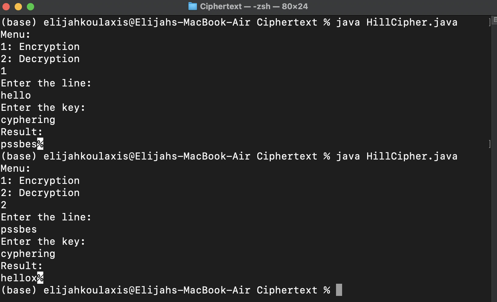

# Hill Cipher Java Algorithm

## Encryption

### 1. We take up a string of characters as key matrix to encrypt data and convert this key matrix to number matrix. Rule of numbering alphabets from 0 to 25 (i.e. A=0, B=1…)

### 2. We need to convert this plain text into diagraphs. In order to do that, we will write this from the starting of our first column vector having first letter at the top and second letter at the bottom and after this jumping on to the second column vector having third letter at the top and fourth letter at the bottom and so on.

#### If there were left any places empty then we're putting the letter ‘x’ to fulfill the diagraph.

### 3. We convert these column vectors into their corresponding number codes.

### 4. We multiple each column vector from the key matrix and obtain the result.

### 5. If we have any numbers greater than 26, we need to divide these column vectors with 26 and note the remainder.

### 6. We convert these numbers back to letters

## Decryption

### 1. We need to find the inverse of our key matrix.

### In order to do that we will have to find the determinant of our key matrix. If the determinant evaluates to a number greater than 26, then we will have to mod26 so it's less than 26.

### The next step is to find a number, let's call it Q which will provide us the number 1 when mod26 is found after multiplying that number by the modulo of our determinant.

### Also, If we have any negative vectors we're adding 26 so for example -5 would be -5 + 26 = 21.

### Afterwards, we multiply the adjoint with the Q number and then we're using mod26 for every number that's greater than 26. In order for all the numbers to be in the range [0...25]

### We'll get a diagraph of numbers and the next step is to repeat the steps of encryption to decrypt this string.

### We will write the encrypted string in column vectors, and then convert the column vectors into corresponding numbers and multiply them with the inverse of key matrix we found above and then use mod26. Afterwards, we need to transfer these numbers back to letters to get our actual string.

